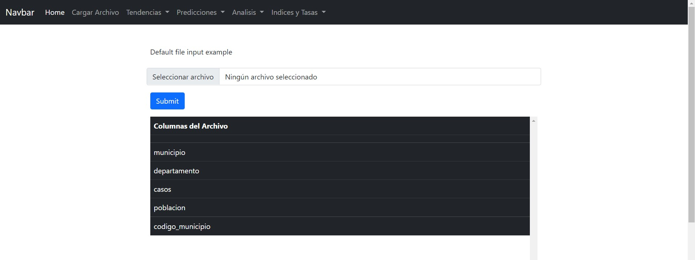
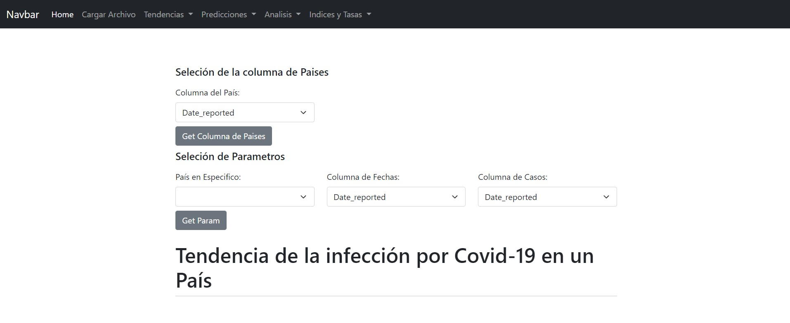
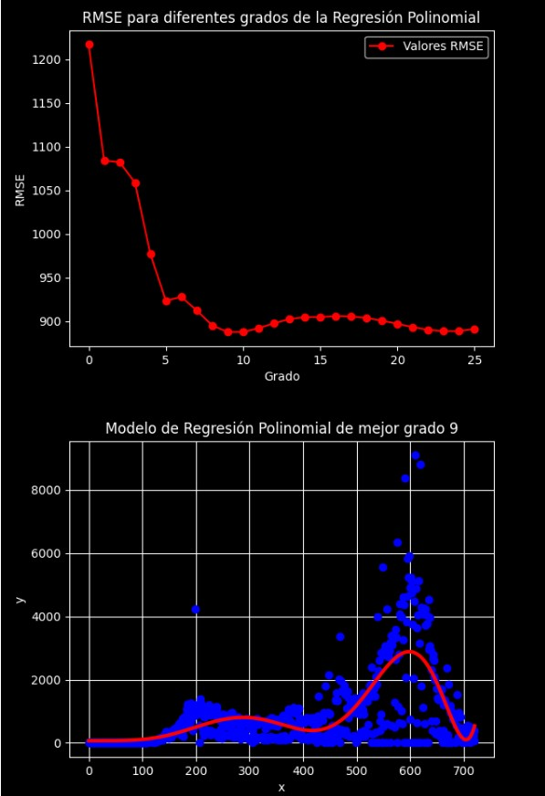
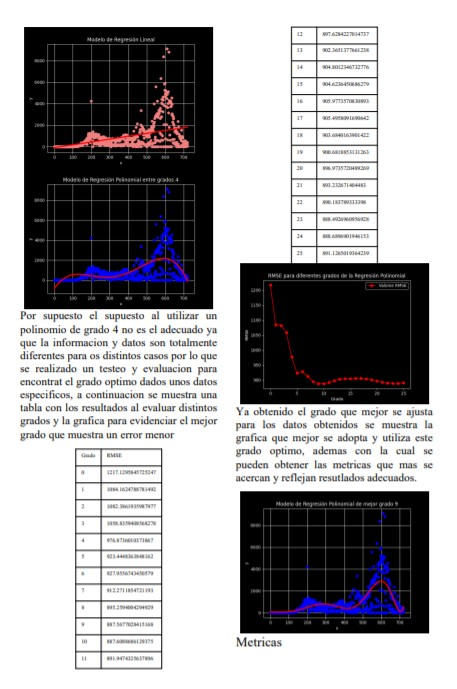
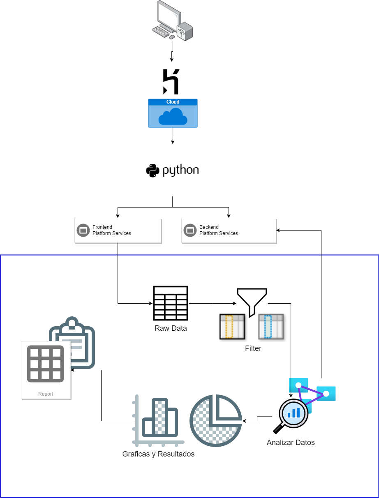

<br><br><br><br>

<h1 align="center" style="font-size: 40px; font-weight: bold;">Proyecto 2</h1>
<h3 align="center" style="font-size: 20px; font-weight: bold;">Manual de Usuario</h3>
<h1 align="center">
  <br>
  <a></a>
  <br>
Machine Learning Covid19
  <br>
</h1>

<h4 align="justify">Este proyecto con enfoque de ciencia de datos se basa en un conjunto de base de datos acerca de la reciente pandemia de Covid19, teniendo como objetivo la evaluacion, analisis e interpretacion de disntintos datos a traves de un conjunto de reportes especializados en un grupo especifico de informacion, donde cada uno produce resultados graficos asi como reportes generales de cada conclusion.
</h4>
<br>

[](https://travis-ci.org/joemccann/dillinger)
[](https://github.com/Hcastleon/OLC2_VCD_PY1/issues)
[](https://lbesson.mit-license.org/)

## Tabla de Contenido

1. [Introduccion](#introduccion)
1. [Objetivos](#obj)
1. [Instalar](#instrucciones)
1. [¿Como funciona?](#detalle)
1. [Definiciones](#def)
1. [Flujo](#flujo)

# 1. Introduccion <a name="introduccion"></a>

Uno de los recursos mas valiosos a lo largo de todo el munod hoy en dia es la informacion, los datos. En una epoca donde todo funciona y se obtiene a traves de datos es logico pensar que es un campo de estudio
Obviamente para un ingeniero en sistemas no es la excepcion saber utilizar herramientas que producen un gran numero de resultados sino tambien saber analizarlos e interpretalos para obtener su mayor provecho en todos los campos que abarca esta ciencia.
<br><br>

# 1. Objetvios <a name="obj"></a>

- Aplicar conceptos de ciencia de datos a informacion relacionada con la pandemia Covid19
- Utilizar librerias relacionadas a data science para el procesamiento de datos
- Brindar resultados precisos en base a lo que se solicita
- Poder generar un reporte formal de los resultados obtenidos
  <br><br>

# 2. Instalar <a name="instrucciones"></a>

Si se desea instalar diritege a la pagina [Quetzal](https://github.com/ByronAlvarez/OLC2_VCD_PY2_ML)

Para clonar esta aplicacion necesitas tener instalado [Git](https://git-scm.com)

```bash
# Clonar el repositorio
$ git https://github.com/ByronAlvarez/OLC2_VCD_PY2_ML
# Entrar a la carpeta
$ cd OLC2_VCD_PY2_ML
# Ejecutar el html
$ python manage.py runserver
```

Nota: Para ejecutar el proyecto es necesario tener instaladas los paquetes necesarios.

# ¿Como funciona? <a name="detalle"></a>

La aplicacion realiza una seria de pasos que conforman su funcionalidad principal

> - <b>Subir Archivo: </b></b> Es funcionalidad de la aplicacion permita cargar la informacion o los datos que se utilizaran posteriormente a traves de tres extensiones diferentes, .csv, .json y .xlxs

<p align="center">
  
</p>
> - <b>Parametrizacion: </b> Esto permite mapear los encabezados o culumnas del archivo entrante para asi seleccionar los unicos valores a utilizar dependiendo del reporte solicitado
<p align="center">
  
</p>
> - <b>Analisis de Datos: </b> En esta funcion se trabjada toda la informacion del lado del back end y produce una salida de resultados y graficas de acorde al reporte solicitado, para su despliegue.
<p align="center">
  
</p>
> - <b>Reportes: </b> Esta opcion permite descargar en formato pdf un reporte en formato IEEE acerca de los resultados y graficas obtenias y su analisis
<p align="center">
  
</p>

# Definiciones <a name="def"></a>

Algunos de los conceptos que se deben saber para comprender los resultados obtenidos.

> - <b>Regresion Lineal</b> Permite determinar el grado de dependencia de las series de valores X e Y, prediciendo el valor y estimado que se obtendría para un valor x que no esté en la distribución.
> - <b>Regresion Polinomial</b> Es una forma de regresión lineal en la que la relación entre la variable independiente x y la variable dependiente y es modelada como un polinomio de grado n en x. La regresión polinomial se ajusta a una relación no lineal entre el valor de x y la correspondiente media condicional de y.
> - <b>RSME</b> TEl error cuadrático medio (RMSE) mide la cantidad de error que hay entre dos conjuntos de datos. En otras palabras, compara un valor predicho y un valor observado o conocido.
> - <b>R2</b> El coeficiente de determinación es la proporción de la varianza total de la variable explicada por la regresión. El coeficiente de determinación, también llamado R cuadrado, refleja la bondad del ajuste de un modelo a la variable que pretender explicar.

# Flujo <a name="flujo"></a>


